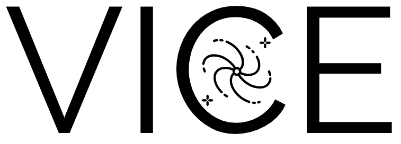

|logo| 

Versatile Integrator for Chemical Evolution
###########################################

|paper1| |paper2| |paper3| 

|python| |version| |MIT Licensed| 

|GitHub CI| |docs| |issues| 

.. 	|python| image:: https://img.shields.io/pypi/pyversions/VICE?label=Python&logo=Python&logoColor=white 
	:target: https://python.org 
	:alt: Python 

..	|version| image:: https://img.shields.io/badge/PyPI-1.3.0-blue.svg
	:target: https://pypi.org/project/vice/ 
	:alt: version

..	|MIT Licensed| image:: https://img.shields.io/badge/license-MIT-blue.svg
	:target: https://raw.githubusercontent.com/giganano/VICE/master/LICENSE
	:alt: MIT License 

..	|issues| image:: https://img.shields.io/github/issues/giganano/VICE.svg
	:target: https://github.com/giganano/VICE/issues 
	:alt: issues 

.. 	|GitHub CI| image:: https://github.com/giganano/VICE/workflows/GitHub%20CI/badge.svg 
	:target: https://github.com/giganano/VICE/actions/workflows/ci.yml 
	:alt: GitHub CI 

.. 	|docs| image:: https://readthedocs.org/projects/vice-astro/badge/?version=latest
	:target: https://vice-astro.readthedocs.io/en/latest/?badge=latest
	:alt: Documentation Status

..	|paper1| image:: https://img.shields.io/badge/NASA%20ADS-Johnson%20%26%20Weinberg%20(2020)-red
	:target: https://ui.adsabs.harvard.edu/abs/2020MNRAS.498.1364J/abstract 
	:alt: Johnson & Weinberg (2020)  

.. 	|paper2| image:: https://img.shields.io/badge/NASA%20ADS-Johnson%20et%20al.%20(2021)-red 
	:target: https://ui.adsabs.harvard.edu/abs/2021arXiv210309838J/abstract 
	:alt: Johnson et al. (2021) 

.. 	|paper3| image:: https://img.shields.io/badge/NASA%20ADS-Griffith%20et%20al.%20(2021)-red 
	:target: https://ui.adsabs.harvard.edu/abs/2021arXiv210309837G/abstract 
	:alt: Griffith et al. (2021) 

VICE is a user-friendly python_ package designed to model chemical enrichment 
in galaxies. 

* 77 elements on the periodic table 
* Fast integration of one-zone models 
* Enrichment from single stellar populations 
* Highly flexible nucleosynthetic yield calculations 
* User-defined mathematical forms describing: 
	- Nucleosynthetic yields in simulations 
	- Mixing processes in multi-zone models 
	- Infall and star formation histories 
	- The stellar initial mass function 
	- The star formation law 
	- Element-by-element infall metallicities 
	- Type Ia supernova delay-time distributions 

.. _python: https://www.python.org/ 

Quick Links
===========

* `Install VICE`__ 
	- `Dependencies`__ 
	- `Installing from Source`__ 
	- `Troubleshoot Your Build`__ 
* `Usage`__ 
	- `Tutorial`__ 
	- `Example Code`__ 
	- `From the Command Line`__ 
* `Documentation`__ 
* `Submit a Bug Report`__ 
* `Cite VICE`__ 
* `Acknowledgements`__ 
* `License`__ 

__ install_ 
__ dependencies_ 
__ sourceinstall_  
__ troubleshoot_ 
.. _install: https://vice-astro.readthedocs.io/en/latest/install.html 
.. _dependencies: https://vice-astro.readthedocs.io/en/latest/install.html#dependencies 
.. _sourceinstall: https://vice-astro.readthedocs.io/en/latest/install.html#installing-from-source
.. _troubleshoot: https://vice-astro.readthedocs.io/en/latest/install.html#troubleshooting-your-build

__ usage_ 
__ tutorial_ 
__ example_ 
__ fromcmdline_ 
.. _usage: https://vice-astro.readthedocs.io/en/latest/getting_started.html
.. _tutorial: https://github.com/giganano/VICE/blob/master/examples/QuickStartTutorial.ipynb
.. _example: https://github.com/giganano/VICE/tree/master/examples
.. _fromcmdline: https://vice-astro.readthedocs.io/en/latest/users_guide/command_line.html

__ docs_ 
.. _docs: https://vice-astro.readthedocs.io/en/latest/

__ issues_ 
.. _issues: https://github.com/giganano/VICE/issues

__ citing_ 
.. _citing: https://vice-astro.readthedocs.io/en/latest/developers/citing.html

__ acknowledgements_ 
.. _acknowledgements: https://vice-astro.readthedocs.io/en/latest/developers/acknowledgements.html

__ license_ 
.. _license: https://vice-astro.readthedocs.io/en/latest/developers/license.html

Journal Related Features 
========================
Under starbursts_, we provide the python_ code which runs the simulations and 
produces the figures in `Johnson & Weinberg (2020)`__. Under migration_, we 
provide the same for `Johnson et al. (2021)`__. 

.. _starbursts: https://github.com/giganano/VICE/tree/master/starbursts 
.. _migration: https://github.com/giganano/VICE/tree/master/migration 
__ jw20_ 
.. _jw20: https://ui.adsabs.harvard.edu/abs/2020MNRAS.498.1364J/abstract 
__ j21_ 
.. _j21: https://ui.adsabs.harvard.edu/abs/2021arXiv210309838J/abstract 

