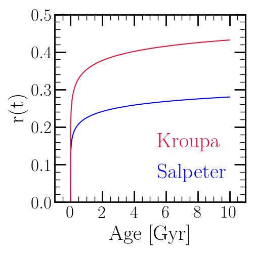

	The cumulative return fraction as a function of age for Kroupa [21]_ (red) 
	and Salpeter [22]_ (blue) IMFs. The Kroupa IMF is higher at all nonzero 
	ages because it has fewer low mass stars than Salpeter. In both cases 
	the post main sequence lifetime is assumed to be 10\% of the main sequence 
	lifetime (i.e. :math:`p_\text{MS} = 0.1`). 

.. [21] Kroupa (2001), MNRAS, 322, 231 
.. [22] Salpeter (1955), ApJ, 121, 161 
