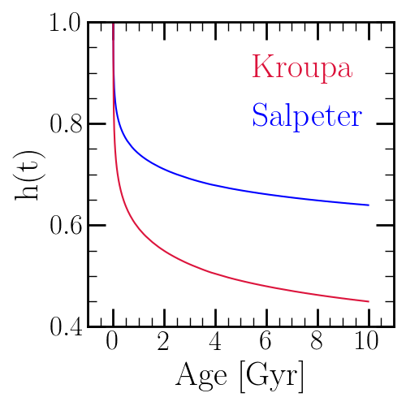

	The main sequence mass fraction as a function of age for Kroupa [25]_ and 
	Salpeter [26]_ IMFs. The Kroupa IMF is lower at all nonzero ages because 
	it has fewer low mass stars than Salpeter. 

.. [25] Kroupa (2001), MNRAS, 322, 231 
.. [26] Salpeter (1955), ApJ, 121, 161 
