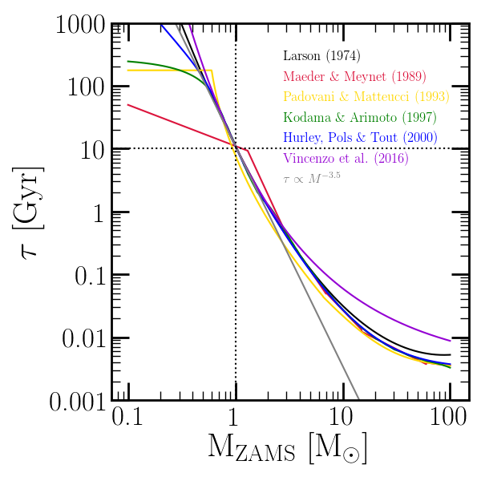

	The total lifetimes of stars as a function of initial mass for the various 
	forms recognized by VICE: Larson (1974; black), Maeder & Meynet 
	(1989; red), Padovani & Matteucci (1993; yellow), Kodama & 
	Arimoto (1997; green), Hurley, Pols & Tout (2000; blue), 
	Vincenzo et al. (2016; purple), and the single power-law 
	relationship (grey; see above). 
	For the forms which take into account the metallicity-dependence of stellar 
	lifetimes (Kodama & Aritmoto 1997; Hurley, Pols & Tout 2000; Vincenzo 
	et al. 2016), the relationship is shown at solar metallicity. 
	Those that compute main sequence lifetimes only as opposed to total 
	lifetimes (all except Kodama & Arimoto 1997 and Vincenzo et al. 2016) are 
	calculated with :math:`p_\text{MS}` = 0.1 (i.e. the inferred *total* 
	lifetimes are plotted for all forms). 

