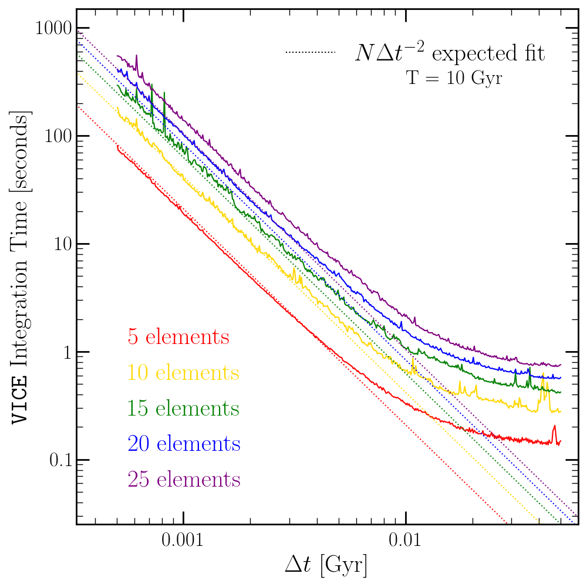

.. _implementation:

Implementation
==============

Motivation
----------
VICE is designed in such a manner that as few assumptions as possible are made
by the software itself. In this manner, the power the user has over the
parameters of their simulations is maximized. With this motivation, any
quantities that may vary are allowed to do so under user-constructed functions
in Python_. The only assumption VICE's model adopts is physical plausibility.

.. _Python: https://www.python.org/

Numerical Approach
------------------
Because VICE is built to handle singlezone and multizone simulations, numerics
are not the dominant source of error, but rather in the model itself. The
assumption of instantaneous diffusion of newly produced metals introduces an
error that which is larger than even modest numerical errors to the equations
presented in this documentation.

For this reason, VICE is implemented with a Forward Euler timestep solution,
and its errors are not dominated by numerics. Furthermore, quantization of the
timesteps allows the quantization of the episodes of star formation with no
further assumptions. At several instances in this documentation, this will
simplify the equations considerably. Adopting a user-specified timestep size,
this also makes it the computationally cheapest solution by not introducing
intermediate timesteps. In this manner, VICE is able to achieve a high degree
of generality while retaining powerful computing speeds.

Minimization of Dependencies
----------------------------
VICE is implemented in its entirety in ANSI/ISO C, standard library Python_,
and standard library Cython_. With this implementation, VICE is entirely
cross platform and independent of the user's version of Anaconda_ (or
lackthereof). However, VICE is not wrapped for installation in a Windows
environment without modifying the installation source code. We recommend users
install and run VICE in a linux environment using the `Windows Terminal`__.

__ windows_terminal_
.. _Cython: https://cython.org/
.. _Anaconda: https://www.anaconda.com/
.. _windows_terminal: https://www.microsoft.com/en-us/p/windows-terminal-preview/9n0dx20hk701?activetab=pivot:overviewtab

Timed Runs
----------
Due to the Forward Euler implementation and the requirement to calculate
enrichment from previous episodes of star formation, we expect the integration
time to scale with the square of the number of timesteps (i.e.
:math:`T \propto (T_\text{end}/\Delta t)^2)`. VICE also treats each element
independently and equally; the equations of enrichment are evaluated for
an arbitrary element :math:`x`. The integration time should thus scale
linearly with the number of elements :math:`N`.

Because VICE was implemented with the scientific motivation of studying the
enrichment of oxygen, iron, and strontium under starburst evolutionary
scenarios (Johnson & Weinberg 2020 [1]_), the first integrations were ran
with these three elements. With timesteps of :math:`\Delta t` = 1 Myr, each
simulation finished in 20.4 seconds on a system with a processing speed of
2.7 GHz. With these proportionalities and this calibration, we expect the
following scaling relation to describe the time per integration of the
``singlezone`` object as a function of the number of elements :math:`N`, the
end time :math:`T_\text{end}`, and the timestep size :math:`\Delta t`:

.. math:: T = \left(\frac{\text{Processor Speed}}{2.7\text{ GHz}}\right)^{-1}
	\left(\frac{T_\text{end}/\Delta t}{10^4}\right)^2
	N(6.8\text{ seconds})

Because 1 Myr is a relatively fine timestep, most integrations will typically
not take this long. The default timestep size of 10 Myr is expected to finish
in 68 milliseconds per element.

.. _fig_timer:

	Timed runs with :math:`N` = 5, 10, 15, 20, and 25 elements with timesteps
	ranging from 500 kyr to 10 Myr (solid lines) with an ending time of
	:math:`T_\text{end}` = 10 Gyr. The color-coded dotted lines show the
	:math:`N\Delta t^{-2}` expected scaling relation. The fit does well for
	small :math:`\Delta t`, but underpredicts the integration time for coarse
	timestepping; this is due to the transition from an algorithm limited
	simulation to a write out limited simulation. The scaling relation also
	slightly underpredicts the integration time for high N simulations.

:ref:`Here <fig_timer>` we plot the integration time for 5, 10, 15, 20, and
25 elements with timesteps ranging from 500 kyr to 10 Myr in comparison to the
expected scaling relation in one-zone models with the ``singlezone`` object.
For small :math:`\Delta t`, the scaling relation describes the integration time
with sufficient accuracy, although slightly underpredicts the integration time
when the number of elements is large. This also underpredicts the integration
time for coarse timestepping; this is
because this scaling relation does not take into account write-out time. For
large :math:`\Delta t`, the ``singlezone`` object is not algorithm limited
but write-out limited. Write out time may also be a potential reason that
the integration time is mildly underpredicted for small :math:`\Delta t` and
high :math:`N`.

.. [1] Johnson & Weinberg (2020), MNRAS, 498, 1364
