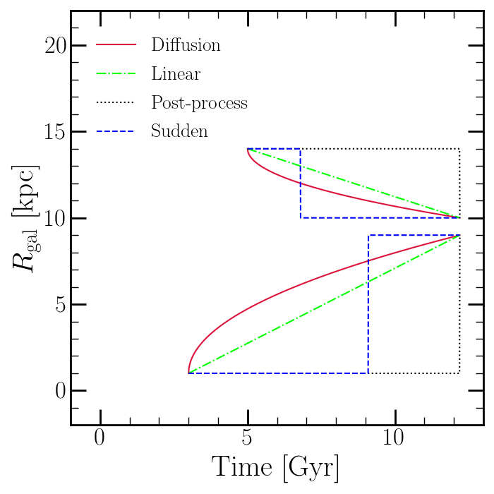

	The four models for the time-dependence of radial migration adopted by 
	VICE's ``hydrodiskstars`` object. This is Fig. 2 of Johnson et al. (2021, 
	in prep [8]_), which investigated the impact of these models on the 
	model-predicted abundances. With the birth radius of a stellar population 
	assumed to be at the center of its annulus of birth, a final radius implied 
	by the :math:`\Delta R` of the assigned ``h277`` star particle, and one of 
	these assumptions, the radius at all times is known. 
	
.. [8] Johnson et al. (2021), in prep 
