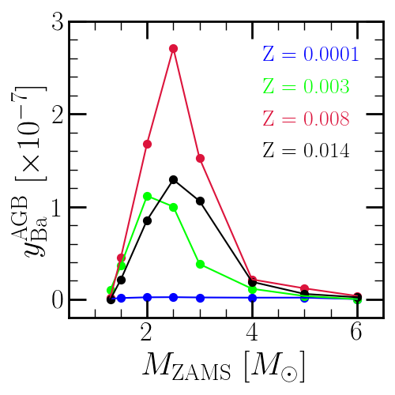

	The AGB star yields of barium (Ba) built into VICE as reported by 
	Cristallo et al. (2011, 2015) for :math:`Z` = 0.0001 (blue), 0.003 (bright 
	green), 0.008 (dark red), and 0.014 (black) progenitors. 

